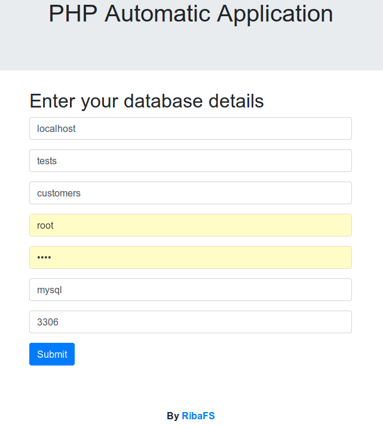
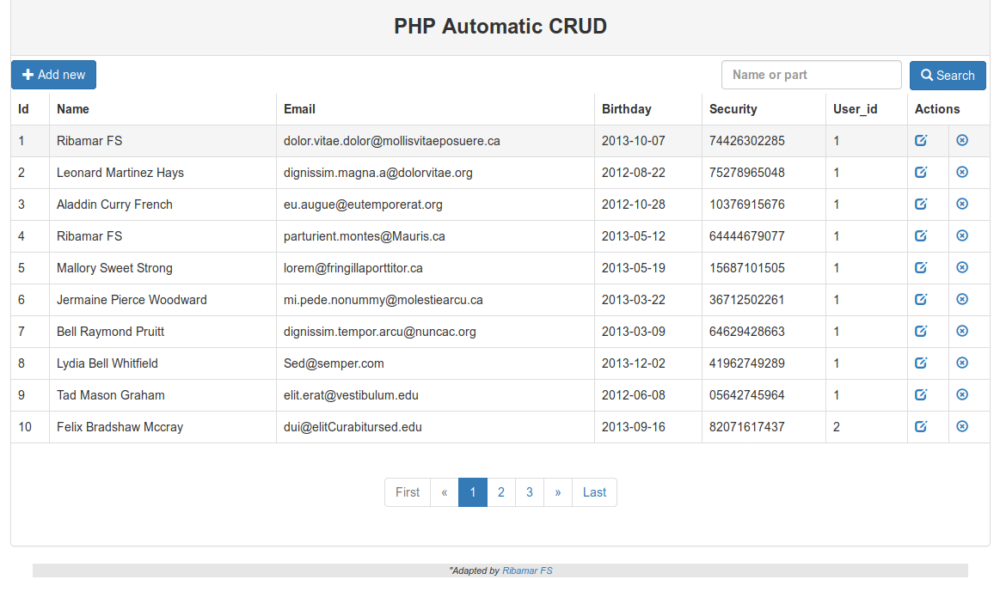

# PHP Automatic CRUD

## Em Português
 https://github.com/ribafs/auto-app/README-pt_BR.md

Are only two classes, Connection() and Crud() with good methods and the basic files from CRUD. You will not have to type any field names and no lines of code. It will automatically generate the code of a CRUD.

## This project URL

https://github.com/ribafs/auto-crud

## Requirements:

- PHP (Im using 7.2, but should also work in the 5.x)
- All web server supported by PHP, including native
- MySQL or PostgreSQL (with small adaptations also rotates in the others supported by the PDO)
- Writing permission to the web server in the application folder (on Linux systems or similar)
- For everything to work properly you need table to have the primary key called "id".

## Good Resources:

- Simple OOP PHP
- PHP with PDO
- Pagination of results with bootpag
- Integrated search
- BootStrap 4

## Installation

- Make download and uncompress in your web directory. 
- Example: /var/www/html/auto-crud or c:\xampp\htdocs\auto-crud
- Create a database, import script db.sql or use a existing database
- Call by browser with - http://localhost/auto-crud
- It will open the form for entering the data of the bank, as below:

- Enter the database info and click in Send.
- Then you will already be in front of the CRUD, as the screen below

Now try and see anothers features.

## Origin

This software started from the application "crud_phpoo" from repository:

https://github.com/ribafs/aplicativos-php

## To change table:

- You can manually edit the classes/connection.php
- Or simply remove the classes/connection.php and call again - http://localhost/auto-app

## Automatic CRUD

Using this software I create another proejct and call auto-crud, which does this same magic but only for one tables.

https://github.com/ribafs/auto-crud

## Credit

The basic pagination I used to create this application was found at the following site::

https://www.kodingmadesimple.com/2017/01/simple-ajax-pagination-in-jquery-php-pdo-mysql.html

## License

MIT

## Suggestions are will be very welcome:

- Issues
- Forks
- Pull Requests

